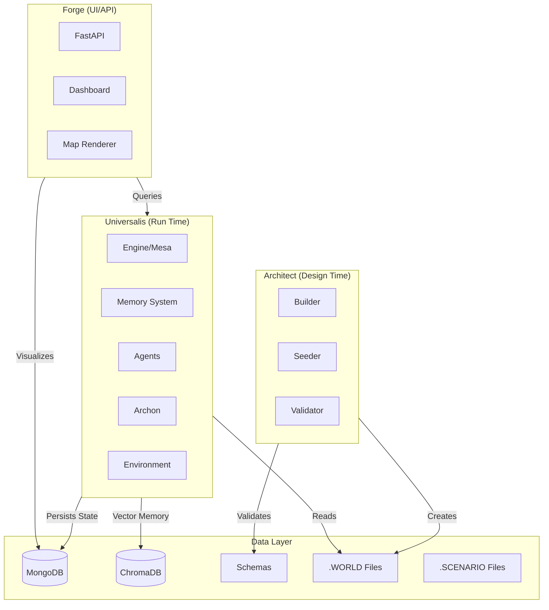

# PyScrAI Master Dev

elopment Plan

## Executive Summary

This plan synthesizes the target architecture from `dev_plan.MD` with the Concordia integration analysis to create a comprehensive development roadmap. The plan prioritizes immediate migration to the Triad structure (architect/universalis/forge) to enable scalable Macro/Micro agent coexistence, while selectively adopting Concordia's memory and LLM abstraction patterns through ChromaDB-backed adapters.

## Architecture Overview




## Current State Analysis

**Existing Codebase:**

- Location: `pyscrai/src/` (flat structure)
- Stack: Mesa 3.0, LangGraph, FastAPI, MongoDB, ChromaDB (in requirements)
- Components: `main.py`, `graph_logic.py`, `schemas.py`, `seed_mongodb.py`
- Limitations: No persistent memory, direct LLM calls, simple actor model

**Target Structure:**

- `architect/`: World/scenario creation tools
- `universalis/`: Simulation engine (current codebase)
- `forge/`: UI/API layer
- `data/`: Schemas, worlds, scenarios, database storage

## Phase 1: Structural Migration (Foundation)

### 1.1 Create Triad Directory Structure

**New Structure:**

```javascript
pyscrai_universalis/
├── main.py                    # Entry point (bootloader)
├── config.py                  # Global configuration
├── requirements.txt
├── architect/                 # [NEW] Design Time
│   ├── __init__.py
│   ├── builder.py
│   ├── seeder.py             # Migrate from src/seed_mongodb.py
│   ├── validator.py          # Multi-level validation
│   ├── pipeline.py           # Seed-to-state compilation
│   └── context_validator.py  # Historical/contextual validation
├── universalis/               # [NEW] Run Time Engine
│   ├── __init__.py
│   ├── engine.py             # Migrate Mesa logic from src/main.py
│   ├── memory/               # [NEW] Memory system
│   │   ├── __init__.py
│   │   ├── associative.py    # ChromaDB adapter
│   │   ├── scopes.py         # Memory scoping (PUBLIC/PRIVATE/SHARED)
│   │   ├── pruning.py        # Memory consolidation and decay
│   │   └── stream.py         # Chronological event log
│   ├── agents/               # [NEW] Agent logic
│   │   ├── __init__.py
│   │   ├── llm_controller.py # LLM abstraction layer
│   │   ├── macro_agent.py    # Strategic/organizational agents
│   │   └── micro_agent.py     # Individual/social agents
│   ├── archon/               # [NEW] Adjudication logic
│   │   ├── __init__.py
│   │   ├── interface.py      # Archon interface definition
│   │   ├── feasibility.py   # Feasibility checking engine
│   │   └── adjudicator.py    # Migrate from graph_logic.py
│   └── environment/          # [NEW] Physics/World State
│       ├── __init__.py
│       ├── weather.py
│       └── logistics.py
├── forge/                    # [NEW] UI/API
│   ├── __init__.py
│   ├── app.py                # Migrate FastAPI from src/main.py
│   ├── dashboard/
│   │   ├── __init__.py
│   │   ├── viewport.py       # Unified viewport with resolution toggle
│   │   ├── macro_view.py     # Macro resolution components
│   │   ├── micro_view.py     # Micro resolution components
│   │   └── components.py     # Shared UI components
│   └── map/
│       ├── renderer.py
│       └── layers.py
├── data/                     # [NEW] Storage
│   ├── database/             # MongoDB/ChromaDB data
│   ├── schemas/              # JSON/YAML schemas
│   ├── worlds/               # .WORLD files
│   └── scenarios/            # .SCENARIO files
├── utils/                    # [NEW] Shared utilities
│   ├── logger.py
│   └── converters.py
└── tests/
```

**Migration Tasks:**

- [ ] Create all new directory structures
- [ ] Migrate `src/main.py` → split into `main.py` (bootloader), `universalis/engine.py` (Mesa), `forge/app.py` (FastAPI)
- [ ] Migrate `src/graph_logic.py` → `universalis/archon/adjudicator.py` + `universalis/agents/` modules
- [ ] Migrate `src/schemas.py` → `data/schemas/` (keep as Python modules for now, add JSON Schema later)
- [ ] Migrate `src/seed_mongodb.py` → `architect/seeder.py`
- [ ] Update all imports across codebase
- [ ] Update `requirements.txt` with Concordia dependencies (sentence-transformers, numpy, pandas)

### 1.2 Refactor Core Components

**Files to Modify:**

- `universalis/engine.py`: Extract Mesa `SimulationEngine` from current `main.py`
- `universalis/archon/adjudicator.py`: Extract Archon logic from `graph_logic.py`
- `universalis/archon/interface.py`: Define explicit Archon interface
- `universalis/archon/feasibility.py`: Implement feasibility engine
- `forge/app.py`: Extract FastAPI routes from current `main.py`
- `main.py`: New bootloader that initializes all three layers

**Key Changes:**

- Separate simulation logic from API layer
- Enable headless engine operation
- Prepare for multi-resolution agent support

### 1.3 Strengthen Archon Layer

**Objective:** Define explicit Archon interface with feasibility checking and traceability.**Archon Interface (`universalis/archon/interface.py`):**

```python
class ArchonInterface:
    def adjudicate(self, world_state: WorldState, actor_intents: List[str]) -> AdjudicationResult
    def check_feasibility(self, intent: str, world_state: WorldState) -> FeasibilityReport
    def generate_rationale(self, result: AdjudicationResult) -> str
```

**Feasibility Engine (`universalis/archon/feasibility.py`):**

- Mathematical constraint checking (budget, logistics, physical laws)
- Resource availability validation
- Temporal consistency checks
- Policy compliance verification

**Traceability:**

- Store adjudication rationales in memory stream (`universalis/memory/stream.py`)
- Link rationales to specific actor intents and world state snapshots
- Enable Forge to display "why" a strategic move succeeded or failed

**Files:**

- `universalis/archon/interface.py`: Archon interface definition
- `universalis/archon/feasibility.py`: Feasibility checking engine
- `universalis/archon/adjudicator.py`: Implement interface with feasibility checks
- `universalis/memory/stream.py`: Store rationales for traceability

## Phase 2: Concordia Integration (Selective Adoption)

### 2.1 Language Model Abstraction Layer

**Objective:** Create Concordia-style `LanguageModel` interface adapter for LangChain/OpenRouter.**Implementation:**

- Create `universalis/agents/llm_controller.py` implementing Concordia's `LanguageModel` interface
- Wrap existing `ChatOpenAI` instance with adapter pattern
- Maintain Langfuse callbacks for observability
- Support `sample_text()` and `sample_choice()` methods

**Files:**

- `universalis/agents/llm_controller.py`: New LLM abstraction
- `universalis/agents/llm_provider.py`: Adapter implementing `LanguageModel` interface
- Update `universalis/archon/adjudicator.py`: Use new LLM abstraction
- Update `universalis/agents/macro_agent.py`: Use new LLM abstraction

**Interface Mapping:**

```python
# Concordia Interface → LangChain Adapter
sample_text(prompt, max_tokens, temperature) → ChatOpenAI.invoke()
sample_choice(prompt, responses) → LLM scoring/selection
```


### 2.2 ChromaDB Memory Adapter

**Objective:** Create ChromaDB-backed memory system implementing Concordia's `AssociativeMemoryBank` interface with cross-agent memory isolation and pruning.**Implementation:**

- Create `universalis/memory/associative.py` with `ChromaDBMemoryBank` class
- Implement Concordia's `AssociativeMemoryBank` interface:
- `add(text, scope: MemoryScope)` - Store memory with embedding and scope tag
- `retrieve_associative(query, k, scope: MemoryScope)` - Semantic retrieval with scope filtering
- `retrieve_recent(k, scope: MemoryScope)` - Recency-based retrieval with scope filtering
- `scan(selector_fn, scope: MemoryScope)` - Filter-based retrieval with scope filtering
- `get_state()` / `set_state()` - Checkpointing
- Use sentence-transformers for embeddings (same as Concordia)
- Store actor memories per simulation_id + actor_id

**Memory Scoping (`universalis/memory/scopes.py`):**

- `MemoryScope` enum: `PUBLIC`, `PRIVATE`, `SHARED_GROUP`
- Prevent cross-agent memory interference
- Public memories: News, weather, global events (accessible to all)
- Private memories: Individual status, personal decisions (actor-specific)
- Shared group memories: Organizational knowledge (accessible to group members)

**Memory Pruning (`universalis/memory/pruning.py`):**

- Relevance decay: Reduce weight of old memories over time
- Consolidation: Merge semantically similar memories periodically
- Threshold-based cleanup: Remove memories below relevance threshold
- Scheduled task: Run pruning every N cycles to prevent retrieval latency

**Files:**

- `universalis/memory/associative.py`: ChromaDB adapter with scope support
- `universalis/memory/scopes.py`: Memory scope definitions and filtering
- `universalis/memory/pruning.py`: Memory consolidation and decay logic
- `universalis/memory/stream.py`: Chronological event log (separate from vector memory)
- Update `universalis/agents/micro_agent.py`: Integrate scoped memory retrieval
- Update `universalis/archon/adjudicator.py`: Store adjudication results with PUBLIC scope

**Architecture:**

- **Archival Memory**: ChromaDB (long-term, semantic retrieval, scoped)
- **Active Context**: In-memory summary (short-term, per-cycle)
- **Memory Pruning**: Background task to maintain performance

### 2.3 Memory Integration into Actor Perception

**Objective:** Enhance actor perception with associative memory retrieval.**Implementation:**

- Modify `universalis/agents/macro_agent.py` and `micro_agent.py` perception logic
- Retrieve relevant memories before generating intents
- Store observations and decisions in memory after each cycle
- Maintain backward compatibility with current prompt-based approach

**Files:**

- `universalis/agents/macro_agent.py`: Add memory retrieval to perception
- `universalis/agents/micro_agent.py`: Add memory retrieval to perception
- `universalis/archon/adjudicator.py`: Store global events in memory

## Phase 3: Enhanced Agent Architecture

### 3.1 Macro vs Micro Agent Separation

**Objective:** Implement resolution-based agent architecture supporting both Macro (strategic) and Micro (social) agents.**Implementation:**

- `universalis/agents/macro_agent.py`: Strategic/organizational agents
- Policy-level decision making
- Asset management
- High-level objectives
- `universalis/agents/micro_agent.py`: Individual/social agents
- Memory-driven behavior
- Relationship-aware decisions
- Routine-based actions

**Files:**

- `universalis/agents/macro_agent.py`: New macro agent implementation
- `universalis/agents/micro_agent.py`: New micro agent implementation
- `universalis/engine.py`: Route agents by resolution type
- `data/schemas/actor_schema.py`: Extend Actor model with resolution field

### 3.2 Enhanced Observation System

**Objective:** Implement structured observation processing with automatic memory integration.**Implementation:**

- Create observation pipeline that filters and prioritizes events
- Automatically store observations in actor memory
- Support observation retrieval for context building

**Files:**

- `universalis/agents/observation.py`: Observation processing
- Integrate with memory system

## Phase 4: Data Layer & Persistence

### 4.1 Schema System & Seed-to-State Pipeline

**Objective:** Create strict schemas for .WORLD and .SCENARIO files with seed-to-state pipeline and validation levels.**Implementation:**

- Define JSON Schema for .WORLD files (immutable base)
- Define JSON Schema for .SCENARIO files (delta/patch format)
- Create Pydantic models matching schemas
- Implement validation in `architect/validator.py` with multiple validation levels

**Seed-to-State Pipeline (`architect/pipeline.py`):**

- **Static Base (.WORLD)**: Immutable world definition (geography, demographics, infrastructure)
- **Dynamic Delta (.SCENARIO)**: JSON Patch format modifying specific variables
- Example: `{"op": "add", "path": "/economy/inflation_rate", "value": 0.05}`
- **State Compilation**: Merge .WORLD + .SCENARIO → Initial WorldState
- **Validation**: Ensure delta operations are valid against base schema

**Validation Levels (`architect/validator.py`):**

- **Schema Validation**: JSON Schema compliance
- **Type Validation**: Pydantic model validation
- **Historical/Contextual Validation**: 
- Ensure 2023 scenario doesn't seed 18th-century technology
- Verify social traits match temporal context
- Check actor capabilities against era constraints
- **Constraint Validation**: Resource limits, logical consistency

**Files:**

- `data/schemas/world_schema.json`: JSON Schema for .WORLD files
- `data/schemas/scenario_schema.json`: JSON Schema for .SCENARIO files (JSON Patch format)
- `architect/validator.py`: Multi-level validation logic
- `architect/pipeline.py`: Seed-to-state compilation pipeline
- `architect/context_validator.py`: Historical/contextual validation rules

### 4.2 World Builder

**Objective:** Create tools for building .WORLD files from raw data.**Implementation:**

- `architect/builder.py`: Compile raw data into .WORLD format
- `architect/seeder.py`: Enhanced seeding with .WORLD file support
- Support for real-world data ingestion (Census, USGS, etc.)

**Files:**

- `architect/builder.py`: World compilation logic
- `architect/seeder.py`: Enhanced seeding (migrated from current seed_mongodb.py)

## Phase 5: UI/Visualization Layer

### 5.1 Dashboard Components & Resolution Toggle

**Objective:** Create unified viewport with dynamic dashboards that adapt based on resolution focus.**Implementation:**

- `forge/dashboard/viewport.py`: Unified viewport with resolution toggle
- `forge/dashboard/macro_view.py`: Macro resolution components (graphs, heatmaps, reports)
- `forge/dashboard/micro_view.py`: Micro resolution components (agent inspection, dialogue history, memory visualizer)
- Dynamic UI switching based on selected actor/agent resolution type

**Unified Viewport (`forge/dashboard/viewport.py`):**

- Resolution toggle: Switch between Macro/Micro focus
- Context-aware rendering: UI components change based on selected entity
- Macro Mode: Show policy graphs, asset movements, organizational structure
- Micro Mode: Show agent memory, dialogue history, relationship networks
- Seamless transitions: Maintain context when switching resolutions

**Dynamic Components:**

- Macro View: Policy impact graphs, resource allocation heatmaps, strategic reports
- Micro View: Agent memory visualizer, conversation threads, relationship graphs
- Shared Components: Map overlay, timeline scrubber, event log

**Files:**

- `forge/dashboard/viewport.py`: Unified viewport with resolution toggle
- `forge/dashboard/macro_view.py`: Macro resolution visualization components
- `forge/dashboard/micro_view.py`: Micro resolution visualization components
- `forge/dashboard/components.py`: Shared UI components (map, timeline, etc.)

### 5.2 Map Renderer

**Objective:** Create interactive map visualization.**Implementation:**

- `forge/map/renderer.py`: Map rendering engine
- `forge/map/layers.py`: Weather, population, traffic layers

**Files:**

- `forge/map/renderer.py`: Map rendering
- `forge/map/layers.py`: Layer management

## Implementation Considerations

### Dependency Management

**New Dependencies:**

- `sentence-transformers`: For memory embeddings (Concordia compatibility)
- `numpy`, `pandas`: For memory operations (if needed for compatibility)
- `chromadb`: Already in requirements.txt
- Consider: Add Concordia as optional dependency or extract patterns only

**Decision:** Extract patterns only (no direct Concordia dependency) to maintain flexibility.

### State Persistence

**MongoDB:** Continue using for world state ledger (ground truth)**ChromaDB:** Use for vector memory (actor memories, semantic retrieval)**File System:** .WORLD and .SCENARIO files in `data/worlds/` and `data/scenarios/`

### Backward Compatibility

- Maintain existing API endpoints during migration
- Support both old and new actor models during transition
- Provide migration scripts for existing MongoDB data

## Migration Strategy

### Step-by-Step Approach

1. **Phase 1.1**: Create directory structure (non-breaking)
2. **Phase 1.2**: Migrate files incrementally, update imports
3. **Phase 2.1**: Add LLM abstraction (backward compatible wrapper)
4. **Phase 2.2**: Add ChromaDB memory (optional, actors can work without)
5. **Phase 2.3**: Integrate memory into perception (enhancement, not breaking)
6. **Phase 3+**: Build new features on solid foundation

### Testing Strategy

- Unit tests for each new module
- Integration tests for memory system
- End-to-end tests for simulation cycles
- Backward compatibility tests for API

## Success Criteria

- [ ] Codebase migrated to Triad structure
- [ ] LLM abstraction layer implemented and tested
- [ ] ChromaDB memory adapter functional
- [ ] Actors can retrieve memories during perception
- [ ] Macro and Micro agents can coexist
- [ ] .WORLD file system operational
- [ ] API remains backward compatible
- [ ] All existing functionality preserved

## Risk Mitigation

**Risk:** Structural migration breaks existing functionality